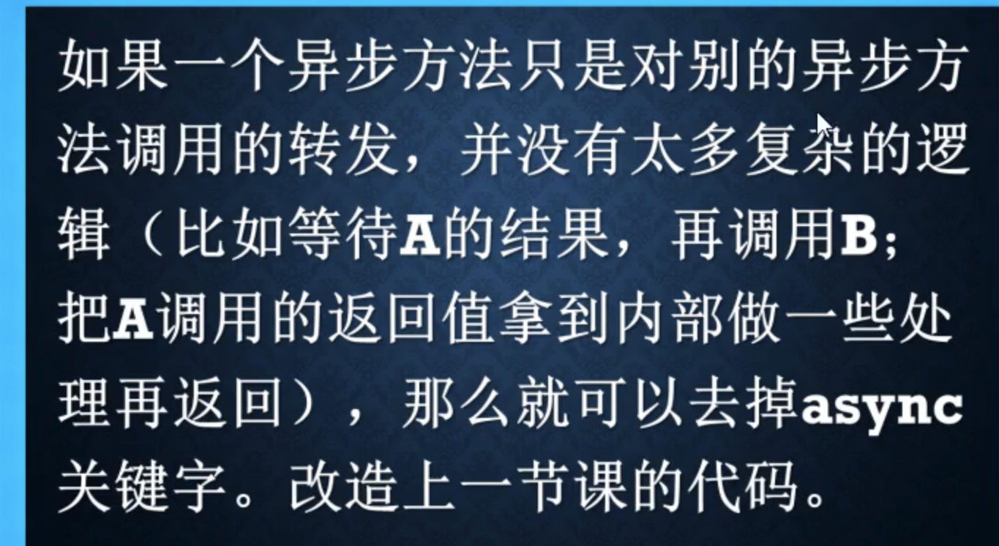

+++
author = "yuhao"
title = "redis test"
date = "2019-03-11"
description = "Sample article showcasing basic Markdown syntax and formatting for HTML elements."
tags = [
    "markdown",
    "css",
    "html",
    "themes",
]
categories = [
    "themes",
    "syntax",
]
series = ["Themes Guide"]
aliases = ["migrate-from-jekyl"]
+++

# Dotnet

# async await:

whenall,cancletoken

接口不要声明 async

# LINQ 扩展方法(实现了 I)

# 依赖注入

服务:对象要的框架

服务容器:管理注册的服务
查询服务:查询对象以及关联对象

对象的生命周期:
瞬态: 获取一次 NEW 一个新的对象
范围:在这个范围内用的是同一个对象
单例:无论谁获取这个服务都是这个对象

[配置](https://www.notion.so/1312db5da48880468938ed2b99e99df3?pvs=21)

# IQueryable 和 IEnumerable 的区别

IENUMBERABLE is executed in the local memory, the other one is complied into the SQL script and executed in the databased server.

so when the number of the query is large, we need to use the Iqueryable because the server tend to have better performance than the local machine

# how to traverse the IQUERYABLE async

# upsetting.json,配置文件

function reload 之后进行热重载

### 使用 configuration 映射配置类

### 环境变量的优先级

**Command-line arguments** > **Environment variables** > **User secrets** > **Configuration files** (e.g., appsettings.json) > **Default values**.

A brief history of GC in .NET
The genesis of the garbage collector (GC) in .NET dates back to 1990 when Microsoft was developing its version of JavaScript, named JScript. Initially developed by a four-person team, one member, Patrick Dussud, who is recognized as the father of .NET’s garbage collector, developed a Conservative GC within the team. At that time, the CLR did not exist, and Patrick was working on the JVM.

Initially, Microsoft aimed to implement its version of the JVM instead of creating something akin to the current .NET runtime. However, once the CLR team was formed, they realized that the JVM imposed certain limitations on them, prompting the creation of their own environment.

With this decision, Patrick redeveloped a new GC from scratch, targeting the “best GC possible” concept, using LISP, his language of expertise. He then wrote a transpiler from LISP to C++ to make the code compatible with Microsoft’s runtime. (The birth of the CLR)

The current codes for the garbage collector used in .NET can be accessed from this file in Microsoft’s runtime repository. Today, Maoni Stephens, the technical lead of Microsoft’s GC team, who has written and presented many conferences and articles on various aspects of GC implementation, can be followed on her blog.

Currently, .NET is equipped with three modes (flavors) of GC, each optimized for different types of applications. Let’s dive into each of these:

Server GC
Optimized for server-side applications like ASP.NET Core and WCF, this variant of GC is designed for environments with high request rates and frequent object allocations and deallocations.

Server GC operates with a separate heap and a GC thread for each processor. This means that if you have an eight-core processor, there will be an independent heap and GC thread on each core during garbage collection.

This approach ensures the collection process is as swift as possible without additional pauses, preventing the application from “freezing”.

Server GC is only executable on multi-core processors. Attempting to run a server-side application in Server GC mode on a single-core processor will automatically result in a fallback to Non-Concurrent Workstation GC.

To use Server GC in non-server-side applications (like WPF, Windows Services, etc.) on multi-core processors, add the following settings to your app.config or web.config:

A brief history of GC in .NET
The genesis of the garbage collector (GC) in .NET dates back to 1990 when Microsoft was developing its version of JavaScript, named JScript. Initially developed by a four-person team, one member, Patrick Dussud, who is recognized as the father of .NET’s garbage collector, developed a Conservative GC within the team. At that time, the CLR did not exist, and Patrick was working on the JVM.

Initially, Microsoft aimed to implement its version of the JVM instead of creating something akin to the current .NET runtime. However, once the CLR team was formed, they realized that the JVM imposed certain limitations on them, prompting the creation of their own environment.

With this decision, Patrick redeveloped a new GC from scratch, targeting the “best GC possible” concept, using LISP, his language of expertise. He then wrote a transpiler from LISP to C++ to make the code compatible with Microsoft’s runtime. (The birth of the CLR)

The current codes for the garbage collector used in .NET can be accessed from this file in Microsoft’s runtime repository. Today, Maoni Stephens, the technical lead of Microsoft’s GC team, who has written and presented many conferences and articles on various aspects of GC implementation, can be followed on her blog.

Currently, .NET is equipped with three modes (flavors) of GC, each optimized for different types of applications. Let’s dive into each of these:

Server GC
Optimized for server-side applications like ASP.NET Core and WCF, this variant of GC is designed for environments with high request rates and frequent object allocations and deallocations.

Server GC operates with a separate heap and a GC thread for each processor. This means that if you have an eight-core processor, there will be an independent heap and GC thread on each core during garbage collection.

This approach ensures the collection process is as swift as possible without additional pauses, preventing the application from “freezing”.

Server GC is only executable on multi-core processors. Attempting to run a server-side application in Server GC mode on a single-core processor will automatically result in a fallback to Non-Concurrent Workstation GC.

To use Server GC in non-server-side applications (like WPF, Windows Services, etc.) on multi-core processors, add the following settings to your app.config or web.config:

A brief history of GC in .NET
The genesis of the garbage collector (GC) in .NET dates back to 1990 when Microsoft was developing its version of JavaScript, named JScript. Initially developed by a four-person team, one member, Patrick Dussud, who is recognized as the father of .NET’s garbage collector, developed a Conservative GC within the team. At that time, the CLR did not exist, and Patrick was working on the JVM.

Initially, Microsoft aimed to implement its version of the JVM instead of creating something akin to the current .NET runtime. However, once the CLR team was formed, they realized that the JVM imposed certain limitations on them, prompting the creation of their own environment.

With this decision, Patrick redeveloped a new GC from scratch, targeting the “best GC possible” concept, using LISP, his language of expertise. He then wrote a transpiler from LISP to C++ to make the code compatible with Microsoft’s runtime. (The birth of the CLR)

The current codes for the garbage collector used in .NET can be accessed from this file in Microsoft’s runtime repository. Today, Maoni Stephens, the technical lead of Microsoft’s GC team, who has written and presented many conferences and articles on various aspects of GC implementation, can be followed on her blog.

Currently, .NET is equipped with three modes (flavors) of GC, each optimized for different types of applications. Let’s dive into each of these:

Server GC
Optimized for server-side applications like ASP.NET Core and WCF, this variant of GC is designed for environments with high request rates and frequent object allocations and deallocations.

Server GC operates with a separate heap and a GC thread for each processor. This means that if you have an eight-core processor, there will be an independent heap and GC thread on each core during garbage collection.

This approach ensures the collection process is as swift as possible without additional pauses, preventing the application from “freezing”.

Server GC is only executable on multi-core processors. Attempting to run a server-side application in Server GC mode on a single-core processor will automatically result in a fallback to Non-Concurrent Workstation GC.

To use Server GC in non-server-side applications (like WPF, Windows Services, etc.) on multi-core processors, add the following settings to your app.config or web.config:

A brief history of GC in .NET
The genesis of the garbage collector (GC) in .NET dates back to 1990 when Microsoft was developing its version of JavaScript, named JScript. Initially developed by a four-person team, one member, Patrick Dussud, who is recognized as the father of .NET’s garbage collector, developed a Conservative GC within the team. At that time, the CLR did not exist, and Patrick was working on the JVM.

Initially, Microsoft aimed to implement its version of the JVM instead of creating something akin to the current .NET runtime. However, once the CLR team was formed, they realized that the JVM imposed certain limitations on them, prompting the creation of their own environment.

With this decision, Patrick redeveloped a new GC from scratch, targeting the “best GC possible” concept, using LISP, his language of expertise. He then wrote a transpiler from LISP to C++ to make the code compatible with Microsoft’s runtime. (The birth of the CLR)

The current codes for the garbage collector used in .NET can be accessed from this file in Microsoft’s runtime repository. Today, Maoni Stephens, the technical lead of Microsoft’s GC team, who has written and presented many conferences and articles on various aspects of GC implementation, can be followed on her blog.

Currently, .NET is equipped with three modes (flavors) of GC, each optimized for different types of applications. Let’s dive into each of these:

Server GC
Optimized for server-side applications like ASP.NET Core and WCF, this variant of GC is designed for environments with high request rates and frequent object allocations and deallocations.

Server GC operates with a separate heap and a GC thread for each processor. This means that if you have an eight-core processor, there will be an independent heap and GC thread on each core during garbage collection.

This approach ensures the collection process is as swift as possible without additional pauses, preventing the application from “freezing”.

Server GC is only executable on multi-core processors. Attempting to run a server-side application in Server GC mode on a single-core processor will automatically result in a fallback to Non-Concurrent Workstation GC.

To use Server GC in non-server-side applications (like WPF, Windows Services, etc.) on multi-core processors, add the following settings to your app.config or web.config:

A brief history of GC in .NET
The genesis of the garbage collector (GC) in .NET dates back to 1990 when Microsoft was developing its version of JavaScript, named JScript. Initially developed by a four-person team, one member, Patrick Dussud, who is recognized as the father of .NET’s garbage collector, developed a Conservative GC within the team. At that time, the CLR did not exist, and Patrick was working on the JVM.

Initially, Microsoft aimed to implement its version of the JVM instead of creating something akin to the current .NET runtime. However, once the CLR team was formed, they realized that the JVM imposed certain limitations on them, prompting the creation of their own environment.

With this decision, Patrick redeveloped a new GC from scratch, targeting the “best GC possible” concept, using LISP, his language of expertise. He then wrote a transpiler from LISP to C++ to make the code compatible with Microsoft’s runtime. (The birth of the CLR)

The current codes for the garbage collector used in .NET can be accessed from this file in Microsoft’s runtime repository. Today, Maoni Stephens, the technical lead of Microsoft’s GC team, who has written and presented many conferences and articles on various aspects of GC implementation, can be followed on her blog.

Currently, .NET is equipped with three modes (flavors) of GC, each optimized for different types of applications. Let’s dive into each of these:

Server GC
Optimized for server-side applications like ASP.NET Core and WCF, this variant of GC is designed for environments with high request rates and frequent object allocations and deallocations.

Server GC operates with a separate heap and a GC thread for each processor. This means that if you have an eight-core processor, there will be an independent heap and GC thread on each core during garbage collection.

This approach ensures the collection process is as swift as possible without additional pauses, preventing the application from “freezing”.

Server GC is only executable on multi-core processors. Attempting to run a server-side application in Server GC mode on a single-core processor will automatically result in a fallback to Non-Concurrent Workstation GC.

To use Server GC in non-server-side applications (like WPF, Windows Services, etc.) on multi-core processors, add the following settings to your app.config or web.config:

A brief history of GC in .NET
The genesis of the garbage collector (GC) in .NET dates back to 1990 when Microsoft was developing its version of JavaScript, named JScript. Initially developed by a four-person team, one member, Patrick Dussud, who is recognized as the father of .NET’s garbage collector, developed a Conservative GC within the team. At that time, the CLR did not exist, and Patrick was working on the JVM.

Initially, Microsoft aimed to implement its version of the JVM instead of creating something akin to the current .NET runtime. However, once the CLR team was formed, they realized that the JVM imposed certain limitations on them, prompting the creation of their own environment.

With this decision, Patrick redeveloped a new GC from scratch, targeting the “best GC possible” concept, using LISP, his language of expertise. He then wrote a transpiler from LISP to C++ to make the code compatible with Microsoft’s runtime. (The birth of the CLR)

The current codes for the garbage collector used in .NET can be accessed from this file in Microsoft’s runtime repository. Today, Maoni Stephens, the technical lead of Microsoft’s GC team, who has written and presented many conferences and articles on various aspects of GC implementation, can be followed on her blog.

Currently, .NET is equipped with three modes (flavors) of GC, each optimized for different types of applications. Let’s dive into each of these:

Server GC
Optimized for server-side applications like ASP.NET Core and WCF, this variant of GC is designed for environments with high request rates and frequent object allocations and deallocations.

Server GC operates with a separate heap and a GC thread for each processor. This means that if you have an eight-core processor, there will be an independent heap and GC thread on each core during garbage collection.

This approach ensures the collection process is as swift as possible without additional pauses, preventing the application from “freezing”.

Server GC is only executable on multi-core processors. Attempting to run a server-side application in Server GC mode on a single-core processor will automatically result in a fallback to Non-Concurrent Workstation GC.

To use Server GC in non-server-side applications (like WPF, Windows Services, etc.) on multi-core processors, add the following settings to your app.config or web.config:
